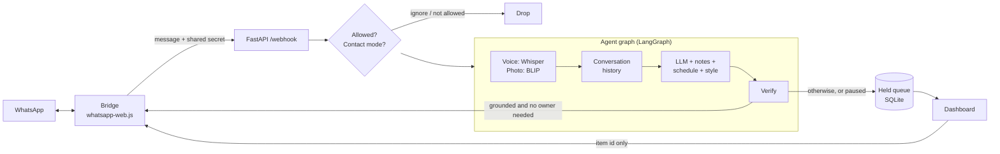

# WhatsApp Assistant Agent

An AI assistant that answers my WhatsApp messages in my own voice (Egyptian Arabic, Franco-Arabic and English),
**and holds anything it isn't sure about for my approval instead of guessing.**

> The goal is not "reply to everything". It is: **never say something I wouldn't say.**

<!-- Add a short demo here:  -->

## Contents
- [What it does](#what-it-does)
- [How a message is decided](#how-a-message-is-decided)
- [Architecture](#architecture)
- [The dashboard and Mika](#the-dashboard-and-mika)
- [Safety design](#safety-design)
- [Privacy and data flow](#privacy-and-data-flow)
- [Setup](#setup)
- [Configuration](#configuration)
- [Tests and evaluation](#tests-and-evaluation)
- [Project structure](#project-structure)
- [Known limits](#known-limits)
- [Roadmap](#roadmap)

## What it does

**On WhatsApp**
- Replies to incoming messages in my writing style (short, casual, feminine forms, no punctuation), matching the sender's language and script.
- Answers questions about my work and schedule **only from facts I wrote down** (`data/kb/about_me.md`), such as what I do, what projects I take, and where I am at a given time.
- Understands **voice notes** (faster-whisper) and **photos** (BLIP captions), and reacts like a friend would.
- **Holds** anything uncertain, personal, or a commitment (invitations, "confirm", "pay") for my approval, and shows me why.
- Optionally retrieves similar past replies from my own chat exports, so the tone stays close to how I really write.

**In the dashboard** (a web page I open from my laptop or phone)
- Approve, edit, send or dismiss held replies.
- Pause all auto-replies with one switch, or set any contact to *reply automatically*, *always ask me first*, or *ignore*.
- Chat with **Mika**, a dashboard assistant that can send messages, draft messages, send my location, and list or read out the messages I received.
- Talk to Mika: dictate, say the wake word, and hear answers spoken back.
- Browse a message history and an activity log.

## How a message is decided

One model call returns the reply plus two flags. The decision to send is plain code, not model judgment:

```text
send automatically  =  reply is not empty  AND  grounded  AND  NOT needs_owner
```

| Flag | Meaning |
|---|---|
| `grounded` | Every fact in the reply comes from the prompt: my notes, my schedule, the current time, or the conversation. False if the model had to guess anything about me. |
| `needs_owner` | Only I can answer: a decision, private information, a detailed project discussion, a complicated technical issue, or any invitation or request to attend, confirm, promise or pay. |

When there is doubt, the default is **hold**. Reasons shown in the dashboard:

| Reason | Cause |
|---|---|
| Needs you to answer | `needs_owner` was true |
| May contain a fact it wasn't sure about | `grounded` was false |
| The model gave no usable answer | Empty or malformed output (fails closed) |
| Auto-reply was paused | The global kill switch is on |
| This contact is set to always ask you first | Per-contact mode |

The two flags are self-reported by the model, so they are a signal, not a guarantee. That is why there is an
[evaluation set](#tests-and-evaluation) that checks what actually gets sent.

## Architecture



| Part | Role |
|---|---|
| **Bridge** (`whatsapp-bridge/`) | A thin Node layer that receives messages and sends replies. Resolves privacy `@lid` ids to phone numbers. Its send API listens on `127.0.0.1` only and needs a shared secret. |
| **Agent** (`app/agent_graph.py`, `app/llm.py`) | LangGraph pipeline: resolve voice or image to text, load history, generate the JSON answer, verify. |
| **Backend** (`app/main.py`) | FastAPI webhook, allowlist, contact modes, kill switch, message log. |
| **Dashboard** (`app/dashboard.html`, `dashboard.py`, `assistant.py`, `controls.py`, `approvals.py`) | Login, held queue, controls, Mika, messages, activity. |

## The dashboard and Mika

| Tab | Purpose |
|---|---|
| **Chat** | Talk to Mika by typing, dictating or voice |
| **Held** | Replies waiting for approval, each with its reason. Edit, send or dismiss |
| **Messages** | Received and sent messages, filtered by contact, day and direction. No AI involved |
| **Activity** | An audit log of automatic replies, holds, approvals and setting changes |
| **Contacts** | Per-contact mode: automatic, always ask me first, or ignore |

Header switches: **Auto-reply** (kill switch), **Direct send**, **Voice chat**, and **Say Mika** (hands-free).

**Things you can say to Mika** (Arabic or English):
- "tell Mom I'm on my way" sends immediately when Direct send is on.
- "write a message to Mom saying I'll be late" shows a draft to review.
- "who messaged me today?" lists and reads out each message with the sender's name.
- "what did Mom send today?" does the same for one contact.
- "send my location to Mom" sends the position of the device the dashboard is open on.

**Voice**
- *Dictation:* faster-whisper on the server, with automatic Arabic or English detection.
- *Spoken replies:* free Microsoft voices (edge-tts) by default, or an instructable OpenAI voice with `TTS_PROVIDER=openai`.
- *Wake word* ("Mika"): uses the browser's speech service in Chrome or Edge; the question itself is transcribed by Whisper.
- An animated orb shows when Mika is listening, thinking or speaking.

Listing messages is a database query: **the model never reads message contents and it costs no tokens**. The page reads them aloud itself.

## Safety design

| Risk | Decision |
|---|---|
| The model invents a fact | Facts may only come from `about_me.md` and the schedule. Malformed or missing flags fail closed into a hold. |
| The model grades its own answer | The flags are measured against an evaluation set rather than trusted. |
| A contact's message tries to instruct the assistant | The dashboard assistant never sees incoming chats, so contacts cannot reach its tools. |
| The browser is used to message arbitrary numbers | Dashboard sends are limited to names in `contacts.json`. Approving a held reply sends only an item id; the chat id comes from the database. |
| A reply is sent twice | Held items move `pending → sending → sent` in one atomic SQL update. |
| Someone finds the tunnel URL | Password login, signed `HttpOnly` `SameSite=Strict` cookie, per-IP lockout. `/webhook` requires the bridge secret. The bridge listens on localhost only. |
| Direct send commits me to a wrong message | It can be switched off. Only exact names from `contacts.json` are valid, and the sent text is shown (and read back after a spoken request). |
| Logs leak private chats | Structured logs hold flags, sizes and an anonymised chat id, never message text, numbers or coordinates. |

## Privacy and data flow

| Data | Where it goes |
|---|---|
| Incoming message text, my notes, schedule, recent conversation | **OpenAI API** (to write the reply) |
| Voice notes, photos, embeddings | Processed **locally** (faster-whisper, BLIP, sentence-transformers) |
| Held replies, conversation memory, message history, audit log | **Local SQLite** (`data/assistant.db`). Message history is deleted after `MESSAGE_RETENTION_DAYS` (default 30) |
| Mika's spoken replies (text only) | Microsoft's online voice service (edge-tts), or OpenAI if `TTS_PROVIDER=openai` |
| Microphone audio for the wake word | The browser's speech service (Chrome or Edge), **only while "Say Mika" is on** |

Only chosen contacts are answered (`ALLOWED_CONTACTS`). Anyone talking to the assistant is talking to software that
imitates me, so I keep it for practical messages and hold personal ones.

## Setup

**Requirements:** Python 3.11+, Node.js 20+, an OpenAI API key, and an HTTPS tunnel (such as Cloudflare Tunnel or
ngrok) if you want the microphone or location in the dashboard from another device.

```bash
# backend
python -m venv venv && source venv/bin/activate     # Windows: venv\Scripts\activate
pip install -r requirements.txt

# bridge
cd whatsapp-bridge && npm install && cd ..

# configuration
cp .env.example .env            # then fill it in
```

1. **`contacts.json`** (project root) maps a name to a phone number or chat id: `{"Mom": "201012345678"}`.
2. **`data/kb/about_me.md`**: your facts. Keep the sections `## Schedule` and
   `## Things to redirect rather than answer directly`; the assistant uses them literally.
3. **`data/style_examples.md`**: short lines in your own voice, one per `-` bullet, grouped by situation.
4. *(optional)* Build the style index from a WhatsApp chat export (`app/export_parser.py` parses it into reply pairs).
   Without `data/style_index/` this step is simply skipped.

```bash
uvicorn app.main:app --port 8000        # 1. start the backend first
cd whatsapp-bridge && npm start         # 2. then the bridge, and scan the QR code once
```

Open `http://localhost:8000/dashboard` (or your tunnel URL) and sign in with `DASHBOARD_PASSWORD`.
Both programs must be running for auto-replies; listing stored messages and chatting with Mika work with the backend alone.

## Configuration

Copy `.env.example` and set at least the **bold** values.

| Variable | Purpose |
|---|---|
| **`OPENAI_API_KEY`**, **`OPENAI_MODEL`** | Model used for replies and for Mika |
| `USER_NAME` | Name the assistant answers to when someone calls you |
| **`DASHBOARD_PASSWORD`** | Dashboard login. Use a long random value: `python -c "import secrets; print(secrets.token_urlsafe(32))"` |
| `TRUST_PROXY` | `true` if behind a tunnel, so lockouts use the real client IP |
| **`BRIDGE_API_TOKEN`** | Shared secret between bridge and backend (both directions) |
| `BRIDGE_API_URL`, `BRIDGE_API_PORT`, `BACKEND_URL` | Where the two programs find each other |
| **`ALLOWED_CONTACTS`** | Comma-separated phone numbers that get answered. Empty means everyone, so set it before going live |
| `ALLOW_GROUPS` | Answer group chats (default `false`) |
| `WHISPER_MODEL_SIZE`, `DASHBOARD_WHISPER_SIZE` | Model size for voice notes and for dashboard dictation |
| `TTS_PROVIDER` | `edge` (free) or `openai` (an instructable, more Egyptian-sounding voice, paid per use) |
| `OPENAI_TTS_VOICE`, `OPENAI_TTS_STYLE`, `OPENAI_TTS_MODEL` | OpenAI voice options |
| `DASHBOARD_VOICE_AR`, `DASHBOARD_VOICE_EN` | edge-tts voices |
| `ASSISTANT_NAME` | Mika's name (also edit the wake-word spellings in `dashboard.html`) |
| `MESSAGE_RETENTION_DAYS` | How long message history is kept (default 30) |
| `REPLY_WITH_VOICE` | Send voice replies on WhatsApp for voice notes (default `false`) |
| `STYLE_RETRIEVAL`, `EMBEDDING_MODEL` | Retrieval of similar past replies |

## Tests and evaluation

```bash
pytest -q                          # unit and API tests; the ML models are stubbed, no GPU or API key needed
python -m evals.run_eval           # real model calls on ~30 messages (costs a few cents)
python -m evals.run_eval --runs 3  # a case passes only if all 3 runs pass
```

The tests cover the login and lockout, the webhook secret, the allowlist (including `@lid` contacts), the kill switch,
contact modes, held-item state transitions, fail-closed output parsing, the message log, the assistant's tool handling,
the chat-export parser and speech helpers. A GitHub Action runs them on every push.

The evaluation set (`evals/cases.jsonl`) checks the decision that matters most: **does anything that should be held get sent?**
It covers casual chat, schedule questions, urgent messages, decisions and invitations, private information,
technical and freelance requests, invented facts, prompt-injection attempts and knowledge-base questions. It reports
unsafe sends, needless holds, invented facts and punctuation-rule slips per category, and exits with an error if
anything unsafe was sent. Add a case every time the assistant gets something wrong.

**Latest results** _(fill in from your own run: date, model, cases, runs per case)_

| Cases | Unsafe sends | Needless holds | Invented facts |
|---|---|---|---|
| _N_ | _0_ | _N_ | _0_ |

## Project structure

```text
app/
  main.py            webhook, allowlist, modes, kill switch
  agent_graph.py     LangGraph pipeline and the send/hold decision
  llm.py             prompt, JSON answer parsing (fails closed)
  memory.py, db.py   conversation memory, held queue, audit, message log (SQLite)
  dashboard.py       login, cookie session, sending, dictation, speech
  dashboard.html     the whole dashboard UI (one file, no build step)
  assistant.py       Mika: tool calling and tool handling
  controls.py        kill switch, contact modes, message and activity feeds
  approvals.py       held-reply approval
  stt.py, tts.py, vision.py, lang.py   Whisper, voices, BLIP, language choice
  style_retrieval.py, export_parser.py  tone retrieval from past chats
  contacts.py, log.py                   contacts.json lookup, structured logging
whatsapp-bridge/     index.js (WhatsApp connection), bridge_api.js (local send API)
tests/               pytest suite
evals/               evaluation cases and runner
data/                kb/about_me.md, style_examples.md, database and logs (not committed)
```

**Do not commit:** `.env`, `data/`, `contacts.json`, `.wwebjs_auth/`, `.wwebjs_cache/`, `node_modules/` or chat exports.
The WhatsApp session folders let anyone who has them use your account.

## Known limits

- `whatsapp-web.js` is an **unofficial** library and can get a number banned. This is a personal tool; anything commercial
  should use the official WhatsApp Business Cloud API.
- The model's flags are self-reported. They are measured by the evaluation set, but they are not a guarantee.
- Photos are described by a captioner, and the model reacts to the caption rather than seeing the photo.
- "Send my location" uses the device the dashboard is open on. A laptop's position is an estimate from Wi-Fi or IP and may be far off.
- The wake word works only in Chrome or Edge, on HTTPS, with the tab open.
- A single owner and a single password; no accounts, rate limits on assistant calls, or monitoring dashboards.
- Transcription of Egyptian Arabic is good but not perfect, and the free voices sound more formal than a real Egyptian speaker.

## Roadmap

- Deterministic pre-filters (money, plans) in front of the model's judgment
- A per-contact "this is an automated reply" disclosure
- Undo for sent messages
- Docker and one-command deployment
- Official WhatsApp Business Cloud API
- Cost limits and alerts for assistant calls


